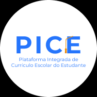
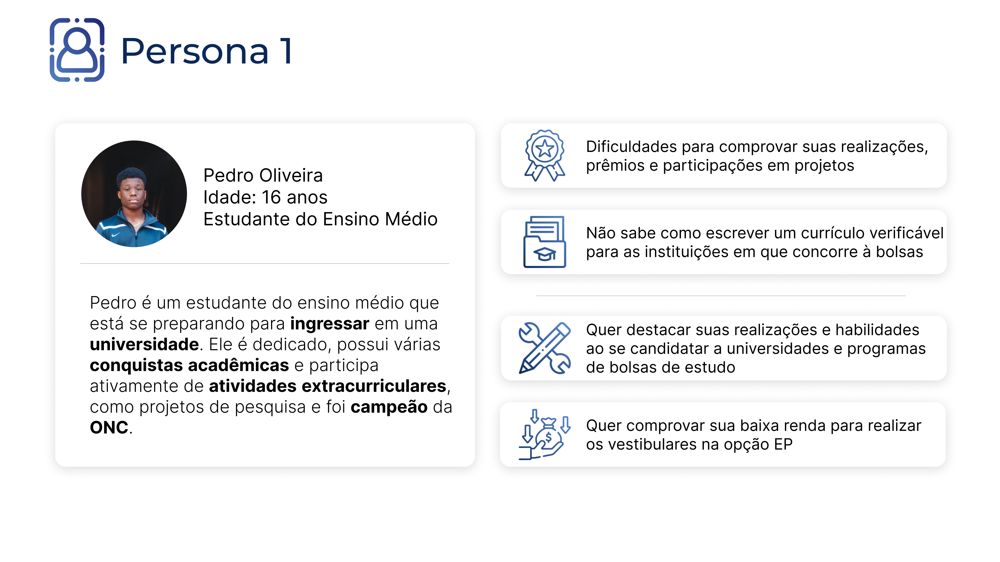
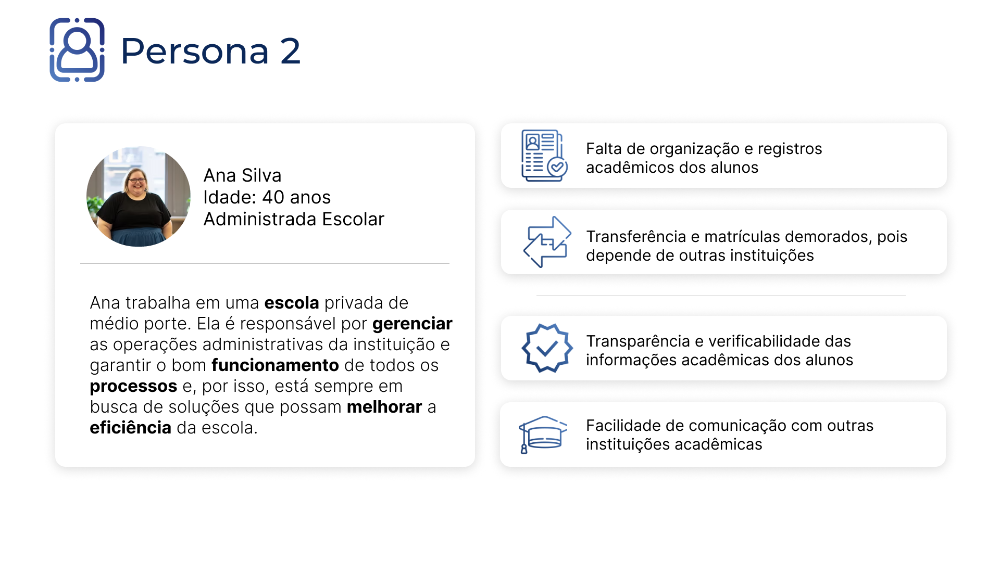
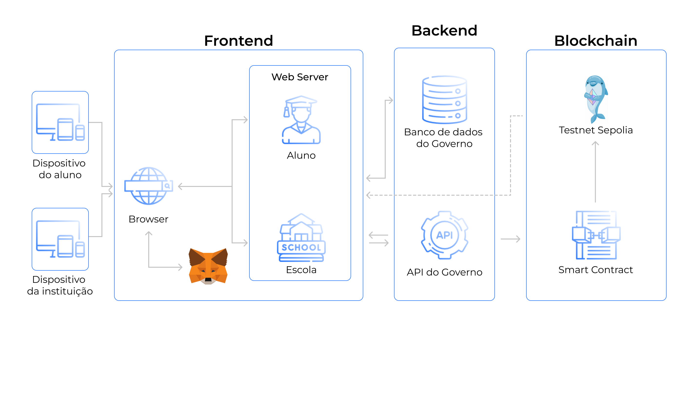
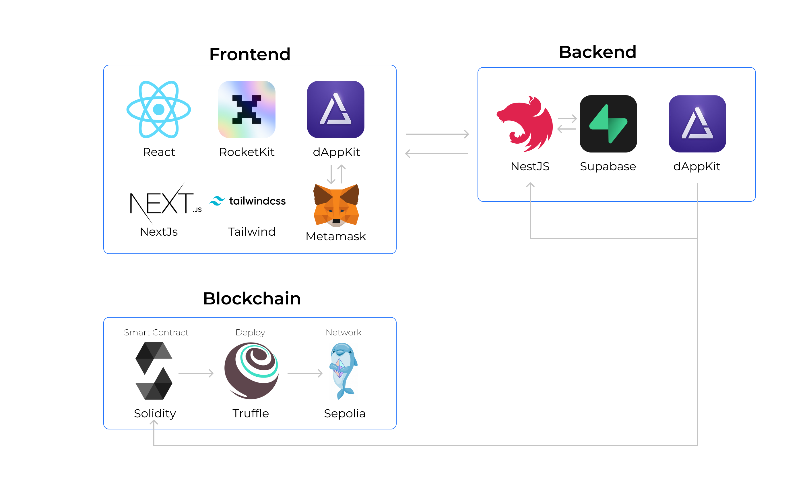

# Plataforma Integrada de Currículo Escolar do Estudante (PICE)

   

 

A PICE é uma plataforma de registro acadêmico baseada em blockchain que empodera os estudantes, permitindo que eles destaquem suas conquistas de forma tangível em candidaturas e contribuindo para uma educação de qualidade e, assim, atingir a ODS 4 da ONU - Educação de Qualidade.

## Cenário

No Brasil, a educação é um direito garantido pela Constituição, segundo o Artigo 205, em que diz: ‘A educação, direito de todos e dever do Estado e da família, será promovida e incentivada com a colaboração da sociedade, visando ao pleno desenvolvimento da pessoa, seu preparo para o exercício da cidadania e sua qualificação para o trabalho', e é composta por diferentes etapas e atores:

1. Educação Básica: A educação básica no Brasil é obrigatória dos 4 aos 17 anos e é dividida em duas etapas: educação infantil (creche e pré-escola), que atende crianças de 0 a 5 anos, e ensino fundamental, que compreende do 1º ao 9º ano. A partir dos 15 anos, os estudantes podem ingressar no ensino médio, que corresponde do 1º ao 3º ano.
2. Gestores educacionais: O Ministério da Educação (MEC) é o órgão responsável por formular e implementar as políticas educacionais em nível federal. Além disso, cada estado e município possui suas secretarias de educação, que são responsáveis pela gestão e implementação das políticas educacionais em nível regional.
3. Escolas públicas e privadas: No Brasil, existem escolas públicas, mantidas pelo governo, e escolas privadas, mantidas por instituições privadas. As escolas públicas são gratuitas e atendem a maioria dos estudantes. As escolas privadas cobram mensalidades e oferecem diferentes abordagens pedagógicas e infraestrutura, variando em qualidade e recursos disponíveis.
4. Professores: Os professores desempenham um papel fundamental na educação brasileira. Eles são responsáveis por ministrar as aulas, elaborar planos de ensino, avaliar os estudantes e promover o aprendizado. Os professores podem atuar nas redes públicas ou privadas, e é necessário possuir formação específica para lecionar, geralmente por meio de cursos de licenciatura.
5. Estudantes: Os estudantes são os principais beneficiários do sistema educacional. Eles frequentam as escolas, participam das aulas, realizam atividades curriculares, olimpíadas, cursos,  e são avaliados em seu desempenho acadêmico. A educação visa fornecer conhecimentos, habilidades e competências necessárias para o desenvolvimento pessoal e profissional dos estudantes.
6. Órgãos de avaliação: No Brasil, existem órgãos responsáveis por avaliar a qualidade da educação, como o Instituto Nacional de Estudos e Pesquisas Educacionais Anísio Teixeira (INEP). O INEP realiza avaliações nacionais, como o Exame Nacional do Ensino Médio (ENEM) e o Sistema de Avaliação da Educação Básica (SAEB), que medem o desempenho dos estudantes, escolas e sistemas educacionais.
7. Universidades e instituições de ensino superior: Após a conclusão do ensino médio, os estudantes podem ingressar em instituições de ensino superior, como universidades e faculdades. As universidades públicas são mantidas pelo governo e oferecem ensino gratuito, enquanto as instituições privadas cobram mensalidades. O acesso ao ensino superior geralmente ocorre por meio de processos seletivos, como o vestibular ou o Exame Nacional do Ensino Médio (ENEM).

Todos esses componentes constituem a esfera educacional brasileira e, principalmente na Educação Básica, agem de maneira individual. Nos últimos anos, o Governo vem integrando esses sistemas com o SEB (Sistema Educacional Brasileiro) e o ID Estudante, mas ainda há um grande caminho a percorrer.

## Definição  do Problema

É importante ressaltar que existem desafios a serem enfrentados no sistema educacional brasileiro, como a desigualdade de acesso, a qualidade desigual entre as escolas, a falta de valorização dos professores e a falta de recursos adequados. No entanto, o Brasil tem implementado iniciativas e políticas visando a melhoria da educação e o aumento da equidade no acesso ao conhecimento. Dentre os problemas, os seguintes podem ser citados:

1. Falta de documentação adequada: Muitas vezes, os estudantes enfrentam dificuldades para documentar e comprovar suas conquistas acadêmicas, como prêmios, participação em projetos ou atividades extracurriculares.
2. Dificuldades na transferência de informações: Quando os estudantes mudam de escola ou se matriculam em uma nova instituição, pode haver uma perda de informações sobre seu histórico acadêmico.
3. Verificação de informações e credibilidade: houve um aumento de fraudes de diplomas acadêmicos, assim como de alunos ativos no sistema acadêmico e de uso dos sistemas de cotas para ingresso em universidades.
4. Desafios na avaliação e seleção: As instituições educacionais e os empregadores frequentemente enfrentam dificuldades na avaliação e seleção de estudantes com base em seus méritos acadêmicos e experiências.
5. Falta de visibilidade e reconhecimento: Muitos estudantes têm habilidades e experiências relevantes que não são adequadamente reconhecidas ou valorizadas por parte de instituições e empregadores.

## Solução

No contexto do sistema educacional brasileiro, A Plataforma Integrada de Currículo Escolar do Estudante busca enfrentar os desafios citados acima. Para abordar esses problemas, ela utiliza a tecnologia blockchain como base, permitindo a criação de um sistema de currículos unificado e seguro. Através da utilização de contratos inteligentes, as instituições de ensino verificadas podem criar e gerenciar os registros das conquistas dos estudantes, representadas como tokens não fungíveis (NFTs). Esses NFTs documentam prêmios, honras, atividades extracurriculares, participação em projetos especiais e outras realizações acadêmicas. Essa abordagem permite uma maior segurança, transparência, portabilidade e agilidade nos processos de verificação, além de promover a inclusão e confiança nas realizações acadêmicas dos alunos.

A utilização da blockchain como base para o sistema de currículos unificado traz benefícios alinhados aos três pilares fundamentais dessa tecnologia: escalabilidade, segurança e descentralização. Por meio da blockchain, é possível garantir a segurança e integridade dos dados dos alunos, uma vez que oferece um ambiente altamente seguro e imutável para o armazenamento dessas informações. Os dados são criptografados e distribuídos em uma rede descentralizada, dificultando qualquer tentativa de adulteração ou falsificação.

Dessa forma, a plataforma garante a confiabilidade das realizações acadêmicas dos estudantes, fornecendo um registro completo de suas conquistas, como prêmios, honras, atividades extracurriculares e participação em projetos especiais. Esse currículo detalhado permite que os alunos se destaquem ao se candidatarem a universidades, bolsas de estudo ou oportunidades de emprego, ressaltando suas habilidades e experiências relevantes.

Além disso, a plataforma facilita a verificação das informações por parte das instituições acadêmicas, empregadores e outras entidades interessadas. O currículo bem organizado e detalhado sobre a vida escolar permite uma verificação eficiente, estabelecendo credibilidade e confiança nas realizações acadêmicas e extracurriculares do estudante. As informações são guardadas em um sistema verificável por todas as partes, o que simplifica processos que exigem comunicação entre instituições, como matrículas e transferências.

A utilização da blockchain também agiliza os processos de verificação das informações acadêmicas. As instituições de ensino, empregadores e outras entidades autorizadas podem acessar diretamente os registros na blockchain, eliminando a necessidade de solicitar e verificar documentos físicos. Isso economiza tempo e esforço para todas as partes envolvidas, tornando o processo mais eficiente.

A portabilidade dos dados é outro benefício proporcionado pela plataforma. Os estudantes têm controle sobre seus próprios dados acadêmicos e podem compartilhar seletivamente seus registros educacionais com instituições de ensino, empregadores ou outras partes interessadas. Isso elimina a necessidade de enviar cópias físicas ou depender de intermediários, oferecendo maior privacidade e conveniência no compartilhamento de informações.

A plataforma também promove a inclusão e o acesso global aos registros acadêmicos dos estudantes. A natureza descentralizada da blockchain permite que os registros sejam verificáveis em qualquer parte do mundo, sendo especialmente benéfico para estudantes que buscam oportunidades educacionais ou empregos em outros países. Além disso, a utilização da blockchain contribui para a distribuição justa e igualitária de cotas, uma vez que avalia o desempenho real dos alunos, garantindo que as cotas sejam atribuídas com base em méritos acadêmicos em vez de presunções raciais.

Outro aspecto relevante é a melhoria na qualidade da educação nacional. Com a coleta de dados abrangentes sobre o desempenho dos alunos, é possível avaliar com mais precisão a qualidade das escolas e do sistema educacional como um todo. Isso proporciona uma maior transparência e prestação de contas para a sociedade, identificando possíveis deficiências e áreas que precisam de melhorias. Essa avaliação mais precisa contribui para o aprimoramento do sistema educacional.

A escolha de um sistema unificado de currículos estudantis baseado na abordagem do currículo Lattes, amplamente reconhecido no meio acadêmico brasileiro, traz benefícios claros aos estudantes. Com o currículo Lattes, é possível registrar de forma abrangente a produção acadêmica, aumentar a visibilidade e o reconhecimento, facilitar a avaliação acadêmica e documentar a formação acadêmica. Esses benefícios são somados às vantagens proporcionadas pela tecnologia blockchain e pelas NFTs, junto com a abstração da blockchain aos alunos e instituições, criando uma plataforma curricular estudantil completa e inovadora.

Em resumo, a Plataforma Integrada de Currículo Escolar do Estudante, baseada na tecnologia blockchain e nas NFTs, traz inúmeros benefícios para a documentação das conquistas e experiências educacionais dos estudantes. Ela garante segurança, transparência, portabilidade e agilidade nos processos de verificação, promovendo a inclusão e a confiança nas realizações acadêmicas. Além disso, contribui para a melhoria da distribuição de cotas, a avaliação da qualidade das escolas, a rastreabilidade e visualização dos dados pela sociedade e o aprimoramento contínuo do sistema educacional.

## A solução e a ODS

A ODS 4 da ONU diz: "**Assegurar a educação inclusiva e equitativa e de qualidade, e promover oportunidades de aprendizagem ao longo da vida para todas e todos**"

Ao alinhar os benefícios do sistema de currículos unificado citados acima, com os objetivos da ODS 4, podemos observar que essa abordagem contribui para uma educação de qualidade ao promover:

1. **Educação inclusiva e equitativa**: A plataforma de currículos unificados promove a inclusão ao oferecer uma documentação abrangente das conquistas dos estudantes, independentemente de sua origem, gênero, raça ou outras características. Isso garante que todos os estudantes tenham a oportunidade de registrar e ter suas realizações reconhecidas de forma justa.
2. **Oportunidades de aprendizagem ao longo da vida**: A plataforma facilita a comunicação e o networking entre os participantes do processo educacional, como estudantes, instituições de ensino e empregadores. Isso cria um ambiente propício para a busca contínua de oportunidades de aprendizagem e desenvolvimento profissional, permitindo que os estudantes se engajem em aprendizagem ao longo da vida.
3. **Educação de qualidade**: A documentação detalhada das conquistas dos estudantes, verificada por meio da blockchain, garante a transparência e a verificabilidade das informações. Isso contribui para a promoção de uma educação de qualidade, ao fornecer um registro confiável e completo das realizações acadêmicas e extracurriculares dos estudantes para toda a sociedade.
4. **Oportunidades iguais de admissão e seleção**: Ao oferecer um sistema de registro curricular padronizado e verificável, a plataforma de currículos unificados cria oportunidades iguais para que todos os estudantes tenham seus méritos e realizações avaliados de forma justa durante processos de admissão em instituições de ensino e seleção para oportunidades educacionais.
5. **Acesso ao conhecimento**: A plataforma facilita o compartilhamento seletivo dos registros acadêmicos dos estudantes, permitindo que eles compartilhem suas realizações com instituições de ensino, empregadores e outras partes interessadas. Isso aumenta o acesso ao conhecimento e às oportunidades, promovendo uma maior equidade no acesso ao conhecimento.

Portanto, a adoção de um sistema de currículos unificado baseado em blockchain está alinhada com o objetivo da ODS 4 da ONU, ao contribuir para uma educação inclusiva, equitativa e de qualidade, além de promover oportunidades de aprendizagem ao longo da vida para todos os estudantes.

## Personas

### Persona 1

Pedro é um estudante do ensino médio que está se preparando para ingressar em uma universidade. Ele é dedicado, possui várias conquistas acadêmicas e participa ativamente de atividades extracurriculares, como projetos de pesquisa e, recentemente, a vitória na Olimpiáda Nacional de Ciências. Por ser um aluno de baixa renda e ter estudado boa parte de sua vida em escolas públicas, Pedro sempre buscou ir além do currículo nacional estudantil e se destacar em outras atividades para garantir uma bolsa em uma universidade, Para isso, ele está animado com a ideia de ter um currículo sobre sua vida escolar documentado de forma segura e imutável, pois vê isso como uma oportunidade de destacar suas realizações e habilidades ao se candidatar a universidades e programas de bolsas de estudo. Além disso, Pedro acredita que ter um registro confiável e transparente de suas conquistas acadêmicas ajudará a construir uma base sólida para seu futuro acadêmico e profissional.

### Persona 2

Ana Silva é administradora em uma escola de médio porte que busca constantemente promover uma educação de qualidade para seus alunos. A escola valoriza o desenvolvimento acadêmico e extracurricular dos estudantes, como Pedro, e está empenhada em fornecer um ambiente de aprendizado inclusivo e equitativo. Com a implementação de um sistema de currículos unificado baseado em blockchain, Ana vê uma oportunidade de melhorar a transparência e a verificabilidade das informações acadêmicas dos alunos. A instituição acredita que isso contribuirá para uma avaliação mais justa e precisa do desempenho dos estudantes, além de facilitar a comunicação com outras instituições acadêmicas nos processos de transferência e matrícula de alunos. Ana vê a solução como uma forma de fortalecer sua reputação e demonstrar seu compromisso com uma educação de qualidade, fornecendo um ambiente seguro e confiável para armazenar e compartilhar os registros educacionais dos alunos.

## Regras de negócio Smart Contract

As regras de negócio do contrato "EducationSystem" são as seguintes:

1. Criação de Escola:

   - Apenas o governo pode criar uma escola.
   - A função `createSchool` permite que o governo crie uma escola ao fornecer o endereço da escola como parâmetro.
2. Criação de Estudante:

   - Apenas o governo pode criar um estudante.
   - A função `createStudent` permite que o governo crie um estudante ao fornecer o endereço do estudante como parâmetro.
   - O estudante criado é associado à escola do remetente da transação.
3. Consulta de Estudante:

   - A função `getStudent` permite que qualquer pessoa consulte as escolas permitidas e os NFTs (tokens não fungíveis) de propriedade de um determinado estudante, fornecendo o endereço do estudante como parâmetro.
4. Exclusão de Estudante:

   - Apenas escolas ou o governo podem excluir um estudante.
   - A função `deleteStudent` permite que escolas ou o governo excluam um estudante ao fornecer o endereço do estudante como parâmetro.
5. Emissão de NFT (Token Não Fungível):

   - Apenas escolas ou o governo podem emitir um NFT.
   - A função `issueNFT` permite que escolas ou o governo emitam um NFT para um determinado estudante, fornecendo o endereço do estudante como parâmetro.
   - Cada NFT emitido é associado à escola emissora, ao estudante e à data de emissão.
6. Destruição de NFT:

   - Apenas escolas podem destruir um NFT emitido por elas.
   - A função `destroyNFT` permite que escolas destruam um NFT emitido por elas ao fornecer o ID do NFT como parâmetro.
   - A destruição só é permitida durante o período de validade do NFT (definido como 30 dias a partir da data de emissão).
7. Consulta de NFTs da Escola:

   - A função `getSchoolNFTs` permite que qualquer pessoa consulte as informações de um NFT emitido pela escola, fornecendo o ID do NFT como parâmetro.
8. Consulta de NFTs de Propriedade do Estudante:

   - A função `seeOwnedNFTs` permite que qualquer pessoa consulte os IDs dos NFTs de propriedade de um determinado estudante, fornecendo o endereço do estudante como parâmetro.
9. Consulta da Origem de um NFT:

   - A função `seeNFTOrigin` permite que qualquer pessoa consulte o endereço da escola emissora de um determinado NFT, fornecendo o ID do NFT como parâmetro.Estrutura de pastas

## Diagrama de Blocos

Um diagrama de blocos é uma representação gráfica que descreve a estrutura e o fluxo de um sistema ou processo. Ele usa blocos ou retângulos para representar diferentes etapas ou componentes do sistema, e setas para indicar a direção do fluxo de informações ou controle entre os blocos.

O objetivo principal de um diagrama de blocos é visualizar de forma clara e concisa o funcionamento interno de um sistema complexo, mostrando como os diferentes componentes se relacionam e interagem entre si, ajudando a identificar os principais elementos do sistema, suas funções e como estão conectados, permitindo uma compreensão geral do processo ou sistema em questão.

No diagrama de blocos acima existem dois atores principais que interagem com o sistema: aluno e instituição de ensino. Os dois atores só conseguem interagir com o sistema após o prévio cadastro do Governo, através da API, que adiciona uma nova instituição, criando uma carteira e um login, e um novo estudante, criano uma carteira que, posteriormente, recebe NFTs atrelados à ela. Esses atores interagem com o sistema através da interface frontend. Para o aluno, basta pesquisar seu nome e todo seu currículo aparece para visualização. Para a instituição, após o cadastro, com sua carteira ou login, pode acessar o sistema e gerenciar as NFTs e os alunos.

No Backend, as informações dos alunos, assim como das instituições, são salvas e somente acessadas pelo Governo. Esse bloco simula o Sistema Educacional Brasileiro (SEB), um cadastro contínuo, preenchido e atualizado pelas intituições de educação que reúne dados do corpo docente e discente e que permite o compartilhamento

Por fim, o bloco blockchain consiste num contrato, em que o Governo pode cadastrar uma nova instituição de ensino ou um novo estudante. O Governo também é responsável por atrelar os estudantes às suas respectivas instituições. A partir disso, elas têm poder de consultar e excluir um estudante e emitir, consultar e destruir um NFT de cada estudante, ou seja, suas atividades acadêmicas e, finalmente, consultar NFTs de uma propriedade única e a origem de emissão do NFT. Todas as funções que ocorrem dentro do contrato estão especificadas na seção acima. Por fim, o contrato é deployado na testnet da Sepolia para permitir a interação dele com os atores.

## Arquitetura da solução

A arquitetura de solução é um conjunto de diretrizes e decisões de design que orientam o desenvolvimento de um projeto ou sistema. Ela descreve a estrutura, os componentes, as interações e as tecnologias envolvidas na solução, fornecendo uma visão abrangente de como os diferentes elementos se relacionam e funcionam juntos para atender aos requisitos e objetivos estabelecidos. A arquitetura de solução serve para garantir a eficiência, escalabilidade, segurança e qualidade da solução. Abaixo, encontra-se a arquitetura do PICE:

1. Frontend: O frontend do projeto é desenvolvido em React, utilizando o framework Next.js para facilitar a construção de aplicações web escaláveis. Para estilização, é utilizado o Tailwind CSS, um framework de design responsivo e altamente customizável e também o RocketKit para o uso de diversos componentes no sistema. Além disso, o projeto contou também com o dAppKit para cinectar o frontend com a blockchain (Metamask).
2. Backend: Construido em Nest.js, *o backend proporciona uma estrutura escalável para o desenvolvimento de APIs* . O banco de dados é gerenciado pelo Supabase, uma plataforma  *que simplifica as operações de banco de dados* . Além disso, o dAppKit é utilizado para estabelecer a conexão com a blockchain e facilitar a execução de funções nos contratos inteligentes. Essa combinação de tecnologias permite uma arquitetura robusta e eficiente para a solução.
3. Blockchain: A tecnologia blockchain desempenha um papel fundamental no projeto, sendo responsável pela gestão de todo o sistema de currículos dos estudantes. Através de um contrato inteligente desenvolvido em Solidity, o Governo tem a capacidade de criar instituições de ensino verificadas e adicionar novos estudantes, que são atribuídos a essas instituições. Além disso, as instituições têm o poder de criar e excluir tokens não fungíveis (NFTs) que representam as atividades dos alunos. Para obter mais informações sobre as funcionalidades disponíveis no contrato, consulte a seção "Regras de Negócio". Por fim, o contrato foi implantado na Testnet da rede Sepolia, utilizando a Truffle Suite como plataforma de desenvolvimento.

### Detalhamento das tecnologias LayerX

Para esse projeto, foram utilizadas as tecnologias RocketKit e dAppKit em diversas seções, visando facilitar o desenvolvimento e integração de todas as partes envolvidas. Essas tecnologias desempenharam papéis essenciais tanto no frontend quanto no backend, proporcionando benefícios significativos.

No frontend, o RocketKit desempenhou um papel fundamental na estilização uniforme da plataforma. Através do reuso de diversos componentes da plataforma Taikai, foi possível garantir uma interface coerente e consistente em todo o projeto. Essa abordagem não apenas agilizou o desenvolvimento, mas também proporcionou uma experiência de usuário mais fluida e intuitiva.

Além disso, o dAppKit desempenhou um papel importante na conexão entre o frontend e a carteira digital Metamask. Essa integração simplificada permitiu uma interação mais fácil e segura com a blockchain, facilitando a execução de transações e o acesso aos recursos necessários para o funcionamento adequado do projeto.

No backend, o dAppKit também desempenhou um papel crucial, pois ao estabelecer uma conexão simplificada para a execução do smart contract, essa tecnologia tornou o processo mais eficiente e menos propenso a erros. Com isso, foi possível aproveitar todo o potencial da blockchain, garantindo a segurança e a confiabilidade das transações realizadas no projeto.

Em resumo, as tecnologias RocketKit e dAppKit foram fundamentais para o desenvolvimento e integração do projeto. Elas contribuíram para uma estilização uniforme no frontend, através do RocketKit, e para uma interação simplificada com a blockchain, tanto no frontend quanto no backend, através do dAppKit. Essas tecnologias proporcionaram uma experiência de usuário aprimorada, maior segurança nas transações e eficiência no desenvolvimento, agregando valor ao projeto como um todo.

## Estrutura de Pastas

O projeto é organizado da seguinte forma:

### Backend

* `src`
  * `government` (API e rotas do Governo)
  * `school` (rotas das instituições)
  * `student` (rotas dos estudantes)
  * `utils` (utilização do dAppKit no backend)

### Blockchain

* `build` (ABIs dos contratos inteligentes utilizados)
* `contracts` (smart contract com todas as funções)
* `migrations` (deploy do contrato na testnet Sepolia)

### Frontend

* `app`
  * `government` (páginas do Governo)
  * `institution` (páginas da Instituição)
  * `student` (página do estudante)
* `components` (componentes utilizados para a construção do frontend)
* `public` (landing page)
* `utils` (utilização das funções do dAppKit e da ABI do contrato)

Essa estrutura de pastas ajuda a organizar e separar de forma clara as diferentes partes do projeto, facilitando o desenvolvimento, manutenção e colaboração no código.

## Instalação

Para instalar o projeto, siga os seguintes passos:

1. Clone o repositório:
2. Diriga-se a pasta frontend:
   `cd frontend/app`
3. Execute `pnpm i` para instalar todas as dependências necessárias
4. Execute `pnpm run dev` para executar o módulo de frontend
5. Saia e dirija-se a pasta backend:
   `cd backend/src`
6. Execute `pnpm i` para instalar todas as dependências necessárias
7. Execute `pnpm start` para executar o módulo de backend

## Como usar o projeto?

## Nosso time

<table>
  <tr>
    <td align="center">
      <a href="https://www.linkedin.com/in/henriquelfmatias/">
         
        
          <b>Henrique Matias</b>
        
      </a>
    </td>
    <td align="center">
      <a href="https://www.linkedin.com/in/lyorreisquintao/">
         
        
          <b>Lyorrei Quintão</b>
        
      </a>
    </td>
  <td align="center"> 
      <a href="https://www.linkedin.com/in/paulo-evangelista/">
         
        
          <b>Paulo Presa</b>
        
      </a>
    </td>
    <td align="center">
      <a href="https://www.linkedin.com/in/sophia-dias/">
         
        
          <b>Sofia Dias</b>
        
      </a>
    </td>
    <td align="center">
      <a href="https://www.linkedin.com/in/victor-severiano-de-carvalho-b57a05237">
         
        
          <b>Victor Severiano de Carvalho</b>
        
      </a>
    </td>
  </tr>
</table>
